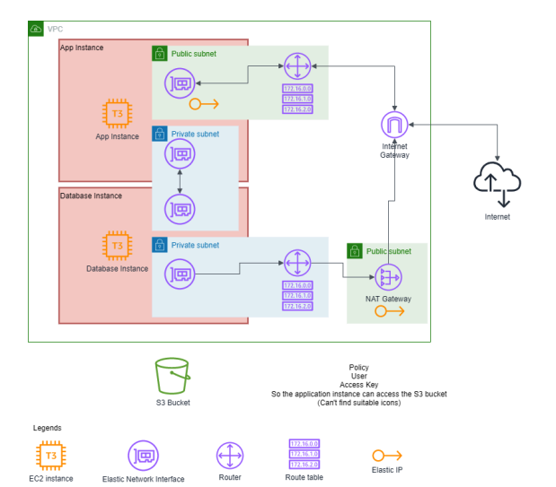

# Terraform-WordPress

## Cloud Architecture

**Diagram explanation:**
Version 2024-02-27
1. An EC2 instance (App) running Wordpress with 2 elastic network interfaces.
a. Interface 1 has an elastic IP attached and is in a publicly accessible subnet
associated with a routing table and an Internet gateway.
Users will connect to Wordpress using the elastic IP on this interface.
b. Interface 2 is in a private subnet used only to communicate with the database
instance.
2. An EC2 instance (Database) running MariaDB, also with 2 elastic network interfaces.
a. Interface 1 is in a private subnet with a route table associated with a NAT
gateway which is associated with an elastic IP, so that your database instance
can access the Internet to download MariaDB.
Note : As good security practice, people must not be able to connect to
the database instance from the Internet directly. Therefore, you should
use a NAT gateway.
b. Interface 2 is in a private subnet used only to communicate with the app
instance.